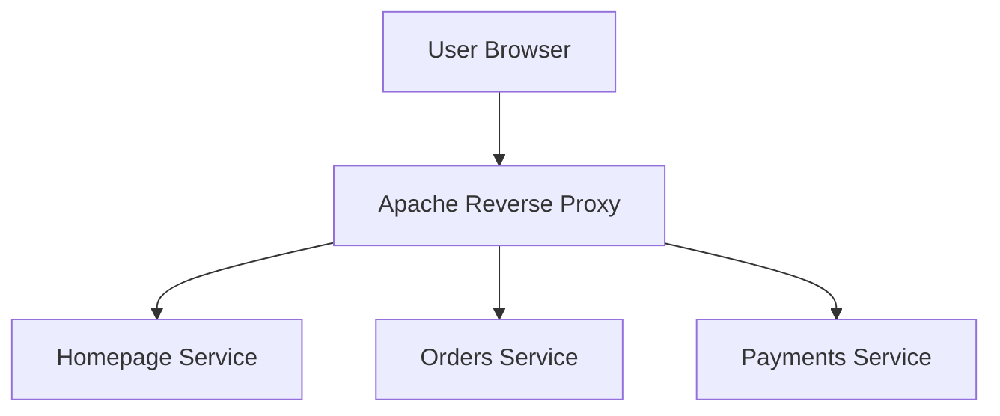

# 🚀 DevOps Microservices Platform
### HTTP → HTTPS using Apache Reverse Proxy on AWS EC2

---

## 📌 Project Overview

This project demonstrates a **production-grade DevOps microservices architecture** deployed on **AWS EC2** using **Python Flask**, **Apache Reverse Proxy**, and **HTTPS with Let’s Encrypt**.

Multiple independent microservices run internally on HTTP and are securely exposed to users through **subdomain-based routing**. Apache acts as a **single secure entry point** for SSL termination and routing.

---

## 🏗️ Architecture (Logical View)



---

## 🧩 Microservices

| Service Name | Description | Internal Port |
|-------------|------------|---------------|
| Homepage Service | Central dashboard / landing page | 5000 |
| Orders Service | Independent backend microservice | 5001 |
| Payments Service | Independent backend microservice | 5002 |

---

## 🚀 Tech Stack

- Python 3
- Flask
- Apache HTTP Server
- Reverse Proxy & SSL Termination
- AWS EC2 (Ubuntu Linux)
- DNS & Subdomains
- Let’s Encrypt (Certbot)

---

## 📁 Project Structure

```text
microservices-app/
├── homepage/
│   └── app.py
├── microservice1/
│   └── app.py
├── microservice2/
│   └── app.py
└── README.md
```

---

## 🌐 Domain Mapping

| Public URL | Service |
|-----------|---------|
| aditechsphere.publicvm.com | Homepage |
| microservice1.aditechsphere.publicvm.com | Orders Service |
| microservice2.aditechsphere.publicvm.com | Payments Service |

---

## 🛠️ Deployment Summary

- EC2 Ubuntu instance
- Apache as reverse proxy
- Flask apps running on localhost
- HTTPS via Let's Encrypt
- HTTP redirected to HTTPS

---

## 🔁 Traffic Flow

```
Browser → HTTPS → Apache → HTTP → Flask
```

---

## 🔒 Security Highlights

- Flask bound to localhost only
- Apache is the only public entry point
- TLS handled at the edge
- Clean separation of layers

---

## 👨‍💻 Author

**Aditya Sirsam**  
DevOps Engineer | AWS | Linux | Docker | Kubernetes
