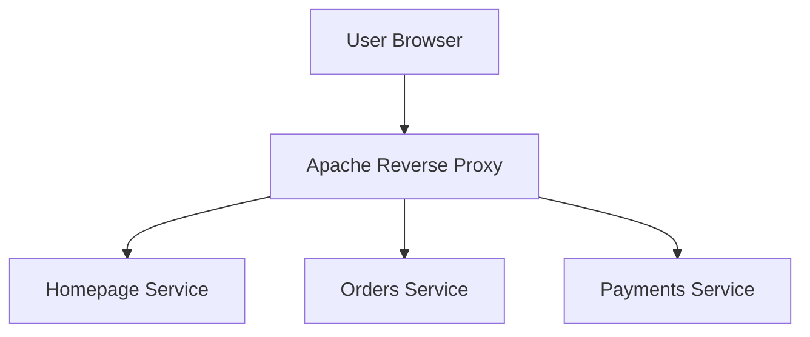

# 🚀 DevOps Microservices Platform
### HTTP → HTTPS using Apache Reverse Proxy on AWS EC2

---

## 📌 Project Overview

This project demonstrates a **production-grade DevOps microservices architecture** deployed on **AWS EC2** using **Python Flask**, **Apache Reverse Proxy**, and **HTTPS with Let’s Encrypt**.

Multiple independent microservices run internally on HTTP and are securely exposed to users through **subdomain-based routing**. Apache acts as a **single secure entry point** for SSL termination and routing.

---

## 🏗️ Architecture (Logical View)



---

## 🧩 Microservices

| Service Name | Description | Internal Port |
|-------------|------------|---------------|
| Homepage Service | Central dashboard / landing page | 5000 |
| Orders Service | Independent backend microservice | 5001 |
| Payments Service | Independent backend microservice | 5002 |

---

## 🚀 Tech Stack

- Python 3
- Flask
- Apache HTTP Server
- Reverse Proxy & SSL Termination
- AWS EC2 (Ubuntu Linux)
- DNS & Subdomains
- Let’s Encrypt (Certbot)

---

## 📁 Project Structure

```text
microservices-app/
├── homepage/
│   └── app.py
├── microservice1/
│   └── app.py
├── microservice2/
│   └── app.py
└── README.md
```

---

## 🌐 Domain Mapping

| Public URL | Service |
|-----------|---------|
| aditechsphere.publicvm.com | Homepage |
| microservice1.aditechsphere.publicvm.com | Orders Service |
| microservice2.aditechsphere.publicvm.com | Payments Service |

---
## Configure Apache Reverse Proxy (HTTP)

Apache exposes each microservice via subdomains and forwards traffic to internal Flask ports.

All HTTP traffic is configured to redirect permanently to HTTPS.

#### Homepage – HTTP Config
File: /etc/apache2/sites-available/aditechsphere.publicvm.com.conf

<VirtualHost *:80>
    ServerName aditechsphere.publicvm.com

    ProxyPreserveHost On
    ProxyPass / http://127.0.0.1:5000/
    ProxyPassReverse / http://127.0.0.1:5000/

    ErrorLog ${APACHE_LOG_DIR}/home_error.log
    CustomLog ${APACHE_LOG_DIR}/home_access.log combined

    RewriteEngine on
    RewriteRule ^ https://%{SERVER_NAME}%{REQUEST_URI} [END,NE,R=permanent]
</VirtualHost>

#### Microservice 1 – HTTP Config
<VirtualHost *:80>
    ServerName microservice1.aditechsphere.publicvm.com

    ProxyPreserveHost On
    ProxyPass / http://127.0.0.1:5001/
    ProxyPassReverse / http://127.0.0.1:5001/

    ErrorLog ${APACHE_LOG_DIR}/ms1_error.log
    CustomLog ${APACHE_LOG_DIR}/ms1_access.log combined

    RewriteEngine on
    RewriteRule ^ https://%{SERVER_NAME}%{REQUEST_URI} [END,NE,R=permanent]
</VirtualHost>

####  Microservice 2 – HTTP Config
<VirtualHost *:80>
    ServerName microservice2.aditechsphere.publicvm.com

    ProxyPreserveHost On
    ProxyPass / http://127.0.0.1:5002/
    ProxyPassReverse / http://127.0.0.1:5002/

    ErrorLog ${APACHE_LOG_DIR}/ms2_error.log
    CustomLog ${APACHE_LOG_DIR}/ms2_access.log combined

    RewriteEngine on
    RewriteRule ^ https://%{SERVER_NAME}%{REQUEST_URI} [END,NE,R=permanent]
</VirtualHost>


Enable sites:

sudo a2ensite aditechsphere.publicvm.com.conf
sudo a2ensite microservice1.aditechsphere.publicvm.com.conf
sudo a2ensite microservice2.aditechsphere.publicvm.com.conf
sudo apachectl configtest
sudo systemctl reload apache2
## Enable HTTPS with Let’s Encrypt
#### Install Certbot
sudo apt install certbot python3-certbot-apache -y

#### Generate SSL Certificate
sudo certbot --apache -d aditechsphere.publicvm.com


##### Certbot:

Verifies domain ownership

Generates SSL certificates

Stores them under /etc/letsencrypt/live/

Installs SSL helper config

#### 🔹HTTPS VirtualHosts (443)

Each service has its own SSL VirtualHost using the same certificate.

###### Example (Homepage):


<VirtualHost *:443>
    ServerName aditechsphere.publicvm.com

    ProxyPreserveHost On
    ProxyPass / http://127.0.0.1:5000/
    ProxyPassReverse / http://127.0.0.1:5000/

    SSLCertificateFile /etc/letsencrypt/live/aditechsphere.publicvm.com/fullchain.pem
    SSLCertificateKeyFile /etc/letsencrypt/live/aditechsphere.publicvm.com/privkey.pem
    Include /etc/letsencrypt/options-ssl-apache.conf
</VirtualHost>


(Same pattern for microservice1 and microservice2.)

##### Enable SSL:

sudo a2enmod ssl
sudo a2ensite aditechsphere.publicvm.com-le-ssl.conf
sudo a2ensite microservice1.aditechsphere.publicvm.com-le-ssl.conf
sudo a2ensite microservice2.aditechsphere.publicvm.com-le-ssl.conf
sudo apachectl configtest
sudo systemctl reload apache2

### 🔁 How HTTP Continues to Work After HTTPS

Flask apps continue running on HTTP internally

Apache performs SSL termination

HTTP requests are redirected to HTTPS

Internal traffic remains unencrypted (trusted network)

Browser → HTTPS → Apache → HTTP → Flask


This is standard production architecture.

## 🔒 Security Notes

Flask ports are bound to localhost

Apache is the only public entry point

SSL auto-renews via Certbot

Ports 5000–5002 can be firewalled for hardening

## 🎯 Why This Project Is Strong for DevOps Roles

Real reverse-proxy configuration

HTTPS migration with zero downtime

Subdomain-based microservices

Production-grade documentation

Easily extendable to Docker / Kubernetes / ALB
## 🛠️ Deployment Summary

- EC2 Ubuntu instance
- Apache as reverse proxy
- Flask apps running on localhost
- HTTPS via Let's Encrypt
- HTTP redirected to HTTPS

---

## 🔁 Traffic Flow

```
Browser → HTTPS → Apache → HTTP → Flask
```

---

## 🔒 Security Highlights

- Flask bound to localhost only
- Apache is the only public entry point
- TLS handled at the edge
- Clean separation of layers

---

## 👨‍💻 Author

**Aditya Sirsam**  
DevOps Engineer | AWS | Linux | Docker | Kubernetes
